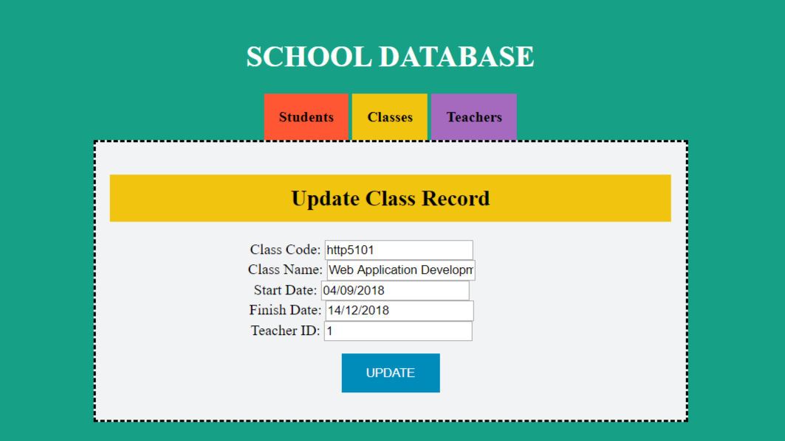

# CRUD Application ( MySql & ASP.NET )

### View All Tables  

  
### Read/Delete One Item  

  
### Update One Item  

  
### Create a New Record
  
  
**Credits:** The base project has been forked from [@christinebittle's repo](https://github.com/christinebittle/crud_essentials). The project's been completed by Hilmi Murat Yildirim & Bhanudai Khairwal.
